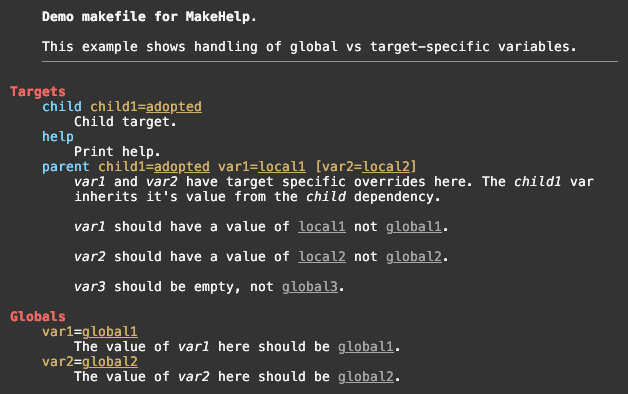
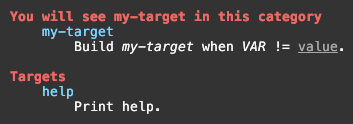
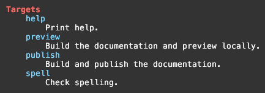
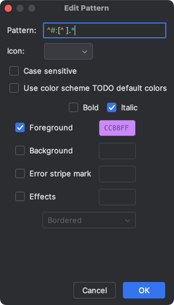
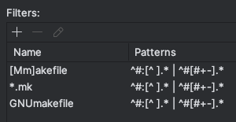

# MakeHelp - A Makefile Help Maker

<div align="center">

</div>

<br clear="left"/>

**MakeHelp** is a simple gizmo for auto-generating help documentation from
makefiles. It is trivial to get started with well presented makefile help, and
flexible enough to generate more complex makefile documentation when required.

**MakeHelp** consists of a small makefile to *include* in your own makefiles and
a single AWK script.


[](https://github.com/jin-gizmo/makehelp/releases/latest)
[](https://github.com/jin-gizmo/makehelp/blob/master/LICENCE.txt)

---
<!-- toc-start min=2 max=2 style=linear -->
<!-- Generated by TOCmark (https://github.com/jin-gizmo/tocmark) -->

[Genesis](#genesis) &bull;
[Prerequisites](#prerequisites) &bull;
[Getting&nbsp;Started](#getting-started) &bull;
[Basics](#the-basics) &bull;
[Going&nbsp;Further](#going-further) &bull;
[Getting&nbsp;Fancy](#getting-fancy) &bull;
[Odds&nbsp;&&nbsp;Ends](#odds-and-ends) &bull;
[Directives](#directives) &bull;
[Make&nbsp;Vars&nbsp;used&nbsp;by&nbsp;MakeHelp](#make-variables-used-by-makehelp) &bull;
[Editor&nbsp;Support](#editor-support-for-makehelp) &bull;
[Limitations](#caveats-and-limitations) &bull;
[Release&nbsp;Notes](#release-notes) &bull;
[More&nbsp;Gizmos](#more-gizmos)

<!-- toc-end -->
---

## Features
<!-- toc text= -->

*   Embedded documentation for makefile targets and variables.

*   Supports *included* files within makefiles.

*   Grouping of documentation for targets and variables into named categories.

*   Generation of documentation for makefile variables and their use in specific
    targets, including recursive resolution of variables from dependencies.

*   Automated text filling and wrapping.

*   Interpolation of makefile variable values into documentation text.

*   Simple markdown-style in-line formatting of help text.

*   Themes provide control over colour selection for headings etc.

*   Depends only on things already installed on macOS and most Linux distros.

*   Supports macOS awk,  nawk, GNU AWK (gawk), POSIX AWK, mawk and BusyBox
    AWK.

> If it ain't broke, it doesn't have enough features yet.

Here is a sample of help output for a fully kitted out makefile.


## Genesis

Most makefiles should have a default target named `help` that does nothing but
print some help for the user.

The [Jin Gizmo](https://jin-gizmo.github.io) tools have multiple, moderately
complex makefiles, with lots of targets and options in the form of makefile
variables that can (or must) be set on the **make** command line.  Historically,
these have been maintained with carefully hand-crafted `help` targets. This has
some obvious problems:

*   The help text is divorced from the things being documented so there is a
    risk of inconsistency.

*   It's tedious and error prone to format the help text nicely and pretty much
    impossible to account for variations in terminal width. 
    
*   Anyone reading the makefile has to flip back and forth between the help
    text and the actual target / variable definitions to work out what's going
    on, or else there is duplication between embedded comments and help text.

There are some clever one-liners out there for generating makefile help
documentation from embedded comments, typically using some combination of
**sed**, **bash**, AWK etc.  Really clever.


But ...

They are all pretty limited, producing simple basic text documentation of
**make** targets with little or no formatting and using code that is
impenetrable hieroglyphics.

I tried using these. I really did. It was frustrating and the results were less
than satisfying for even moderately complex makefiles.

So, I foolishly thought, how hard can this be? A little AWK script will nail it.
Then it sort of got away from me a bit.  Once you go past the bounds of what a
one-liner can reasonably do, you may as well go for broke.

**MakeHelp** is the result. (Yes, all the other solutions are called *make help*
too. What else are you going to call it?)

Best of luck.

> In salute to the one-liners, they were the inspiration for **MakeHelp**, which
> uses the same basic technique of adding special comments into the makefile to
> produce help documentation.

## Prerequisites

**MakeHelp** has no exotic requirements. It needs only the following:

*   **make** (obviously). GNU Make v3 and v4 are fine.
*   AWK : **mawk**, **nawk**, GNU **gawk**, macOS **awk** (ancient nawk?), any
    POSIX **awk**, and BusyBox **awk** are all fine.
*   **bash** 3+
*   **stty**
*   **tput** (optional, but helps with automatic theme selection).

## Getting Started

[Download](https://github.com/jin-gizmo/makehelp/releases/latest) the
**MakeHelp** source code ZIP or tar.gz bundle and unpack it, either in the same
directory as your makefile, or wherever you like. The two `help.*` files from
the bundle need to stay together in the one directory.

> [!NOTE]
>  The `make.vim` file contains syntax colouring instructions for the
> **MakeHelp** additions for **vim**. See
> [Editor Support for MakeHelp](#editor-support-for-makehelp).

Add the following line to your makefile, assuming the **MakeHelp** components
are in the same directory. (Update the location appropriately if a different
directory was used.)

```makefile
include help.mk
```

You will need to disable any existing `help` target in your makefile. (Just
change the name while playing around.)

Try it out:

```bash
make help
# ... or ...
make
```

You should see something like this as **MakeHelp** documents the `help` target
it generates.


> [!IMPORTANT]
> Note that `help.mk` will set the default target to be `help`.

## The Basics
<!-- toc text="Basics" -->

We'll use the following simple makefile as an example:

```makefile
# Demo makefile for MakeHelp.

include help.mk

env=
arch:=$(shell arch)
restart=no
tag=

build:
	@echo Building for $(arch) ...

deploy: preflight build
	@echo Deploying to $(env) with restart=$(restart) ...

preflight:
	@echo Check everything is in order for deployment

clean:
	@echo Cleaning build artefacts ...	
```

This might be used like so:

```bash
make build arch=x86_64
make deploy env=prod restart=yes
```

The first step is to add some comments above the targets and variables we want
included in help text using `##` as the comment marker. **MakeHelp** will
recognise these. Comments with a single `#` are ignored.

```makefile
# Demo makefile for MakeHelp.

include help.mk

## Target deployment environment: `dev` or `prod`.
env=
## Platform architecture for build: `arm64` or `x86_64`.
arch:=$(shell arch)
## Release tag.
tag=
restart=no

## Build some stuff.
build:
	@echo Building for $(arch) ...

## Deploy some stuff.
deploy:	preflight build
	@echo Deploying to $(env) with restart=$(restart) ...

preflight:
	@echo Check everything is in order for deployment

## Delete build artefacts locally.
clean:
	@echo Cleaning build artefacts ...
```

The result from `make` is now:


Key points:

*   `##` comments just before a target or variable are collected to provide a
    description for it. These will be filled and wrapped automatically. A line
    containing only `##` starts a new paragraph.

*   `#` comments are ignored.

*   Descriptions can contain simple Markdown-like in-line styling:
    \*\***bold**\*\*, \**italic*\*, \_<ins>underline</ins>\_ and \``code`\`. 

*   Descriptions can also contain `$(var)` substitutions of variables from the
    makefile itself. For variables with computed values (e.g. `x=$(shell ...)`),
    you may need to use the `:=` form of **make** variable assignment to force
    early evaluation. A **make** variable can be defined before or after it is
    referenced in the makefile.

*   For the variables section of the help, **MakeHelp** will show the default
    value, if possible.

*   To include a target or variable without a description (say what?), precede
    it with a line containing an empty description `##`.

## Going Further

So far, so good. 

We're still missing any clear indication of the variables that may be applicable
to specific **make** targets. Yes, we can add this information into the target
descriptions, but we can do a bit better than that.

**MakeHelp** [directives](#directives) provide additional information and
control for the help text. Directive lines start with `#:` *immediately*
followed by the directive name. We can use the `#:req` and `#:opt` directives to
specify the required and optional **make** command line variables, respectively.

```makefile
# Demo makefile for MakeHelp.

include help.mk

## Target deployment environment. Must be one of `dev` or `prod`.
env=
## Platform architecture for build: `arm64` or `x86_64`.
arch:=$(shell arch)
## Release tag.
tag=
restart=no

## Build some stuff.
#:opt arch tag
build:
	@echo Building for $(arch) ...

## Deploy some stuff. The *env* variable specifies the target environment.
## If *restart* is set to `yes` the system will be restarted after deployment.
#:req env tag
#:opt restart
deploy:	preflight build
	@echo Deploying to $(env) with restart=$(restart) ...

preflight:
	@echo Check everything is in order for deployment

## Delete build artefacts locally.
clean:
	@echo Cleaning build artefacts ...
```

The result from `make` is now:


A *deploy* operation would be invoked like so:

```bash
make deploy env=prod
# ... or ...
make deploy env=prod restart=yes
```

Key points:

*   `#:req` and `#:opt` directives precede the target to specify required
    and optional variables. They can come before or after descriptive content
    introduced by `##`. 

*   `#:req` and `#:opt` directives accept one or more string arguments of the
    form `name` / `name=value`. If a value is not specified in the directive,
    **MakeHelp** will show an existing defined value, if possible. You only need
    to declare the variables that you want the user to know about.

*   Multiple `#:req` / `#:opt` directives are allowed, in any order. The
    contents are aggregated and sorted for display.

*   By default, `#:req` and `#:opt` directives are resolved recursively down the
    tree of dependencies. The `deploy` target depends on the `build` target
    which accepts an optional `arch` and `tag` variables, so `deploy` is also
    shown as accepting them.

*   The `tag` variable is *optional* for the `build` target but is upgraded to
    *required* for the `deploy` target. Required variables override optional
    ones.

## Getting Fancy

For a simple makefile, like our sample, what we have above is plenty. For large,
complex makefiles, it can be handy to group targets and variables into related
categories and present them in a defined order. This is achieved with `#:cat`
directives for targets and `@vcat` directives for variables.

It can also be helpful to include some broader explanatory information as a
prologue / epilogue to the help text as a whole. Lines starting with `#+` become
the prologue and those starting with `#-` become the epilogue.

```makefile
include help.mk

# Assign the "help" target to this category.
HELP_CATEGORY=Miscellaneous targets

#+ **Demo makefile for MakeHelp**.
#+
#+ Go to https://github.com/jin-gizmo/makehelp for more information.

#- *You are standing at the end of a road before a small brick building. Around*
#- *you is a forest. A small stream flows out of the building and down a gully.*
#-
#- (If you know, you know. If you don't, you've missed something that AI will
#- never give you.)

# ------------------------------------------------------------------------------
## Target deployment environment. Must be one of `dev` or `prod`.
env=
## Release tag.
tag=
## Platform architecture for build: `arm64` or `x86_64`.
arch:=$(shell arch)
restart=no

#:cat Primary targets

## Build some stuff.
#:opt arch tag
build:
	@echo Building for $(arch) ...

## Deploy some stuff. The *env* variable specifies the target environment.
## If *restart* is set to `yes` the system will be restarted after deployment.
#:req env tag
#:opt restart
deploy:	preflight build
	@echo Deploying to $(env) with restart=$(restart) ...

preflight:
	@echo Check everything is in order for deployment

#:cat Miscellaneous targets

## Delete build artefacts locally.
clean:
	@echo Cleaning build artefacts ...
```


Key points:

*   `#:cat` directives specify the category to which all subsequent targets are
    assigned until another `#:cat` directive sets a new value. The starting
    value is `Targets`.

*   The `help` target is special because it is provided as part of the included
    `help.mk`. To assign it to a non-default category, set `HELP_CATEGORY` in
    the makefile.

*   Target categories are sorted in the order in which they are first referenced.
    If targets aren't naturally sorted in the makefile, add a sequence of `#:cat`
    directives at the top of the file to enforce the desired order.

*   To force categories to be sorted alphabetically, set `HELP_SORT=alpha` in
    the makefile.

*   Variable categories are always shown after target categories.

*   Within categories, targets and variables are sorted alphabetically.

*   `#:vcat` works exactly the same way as `#:cat` except for variables instead
    of targets. The initial variable category is `Variables`.

*   Formatting of the prologue and epilogue works the same way as for target and
    variable descriptions, including in-line styling, variable substitutions,
    filling and wrapping.
    
## Odds and Ends
<!-- toc text="Odds & Ends" -->

### Target Specific Variables

Target specific **make** variables override global ones. **MakeHelp** handles
this as expected.

```makefile
#+ **Demo makefile for MakeHelp.**
#+
#+ This example shows handling of global vs target-specific variables.

include help.mk

#:vcat Globals

## The value of *var1* here should be `global1`.
var1=global1
## The value of *var2* here should be `global2`.
var2=global2

## *var1* and *var2* have target specific overrides here. The *child1* var
## inherits it's value from the *child* dependency.
##
## *var1* should have a value of `local1` not `global1`.
##
## *var2* should have a value of `local2` not `global2`.
##
## *var3* should be empty, not `global3`.
#:req var1
#:opt var2=$(var2)

parent: var1 := $(shell echo local1)
parent: var2=local2
parent:	child
	@echo "var1=$(var1) var2=$(var2) var3=$(var3)"

## Child target.
#:req child1=adopted
child:
```



Key Points:

*   The global variables `var1` and `var2` are overridden for the `parent`
    target by the target-specific assignments.

*   The `child1` variable is inherited in the `parent` target from its `child`
    dependency.

### Repeated Targets

In some makefiles, the same target may occur more than once. For example:

```makefile
ifeq ($(VAR),value)
my-target:
	@echo "Building $@ with $(VAR) = value"
else
my-target:
	@echo "Building $@ with $(VAR) != value"
endif
```

**MakeHelp** will aggregate all of the description text for a duplicated target
into a single entity for the help output. It will also assign the target to the
category that was in force for the first occurrence with an associated
description.

For example:

```makefile
include help.mk

#:cat You will not see my-target in this category

ifeq ($(VAR),value)
my-target:
	@echo "Building $@ with $(VAR) = value"
else
#:cat You will see my-target in this category
## Build *my-target* when *VAR* != `value`.
my-target:
	@echo "Building $@ with $(VAR) != value"
endif
```



Key points:

*   **MakeHelp** is not evaluating the `ifeq` condition. It is simply collecting
    help text where it finds it.

### Multiple Target Recipes

Some makefiles may use the same recipe for multiple targets within a single
rule. This is commonly used for invoking sub-makes. For example:

```makefile
# Documentation targets are delegated to the "doc" directory.
spell preview publish:
	$(MAKE) -C doc $(MAKECMDGOALS)
```

We don't want the same help text for each target, and we don't want to have to
repeat the same recipe three times. We can use the behaviour described above for
[repeated targets](#repeated-targets) to deal with this by adding the
description for each target to an empty target.

```makefile
include help.mk

## Check spelling.
spell:
## Build the documentation and preview locally.
preview:
## Build and publish the documentation.
publish:

spell preview publish:
	$(MAKE) -C doc $(MAKECMDGOALS)
```



Key points:

*   Directives for things such as category assignment and target variables can
    also be added, as needed.

## Directives

**MakeHelp** *directives* provide additional information and control for the
help text. Directive are lines in the source makefile starting with `#:`
*immediately* followed by the directive name.

> [!IMPORTANT]
> There is no space between the `#:` and the directive name. `#: cat` means
> nothing to **MakeHelp**. 

| Directive | Description                                                  |
| --------- | ------------------------------------------------------------ |
| `#:cat`   | Set the current category for targets. All subsequent targets will be assigned to this category until a new value is set. The starting value is `Targets`. |
| `#:opt`   | Declare one or more variables as optionally accepted by the next target. The directive accepts one or more string arguments of the form `name` or `name=value`. If a value is not specified in the directive, **MakeHelp** will show an existing defined value, if possible |
| `#:req`   | Declare one or more variables as required by the next target. Details as for `#:opt`. |
| `#:tvar`  | Declare the value of a target-specific **make** variable for use by **MakeHelp**. The directive accepts two string arguments, the target name and a variable assignment in the form `name=value`.  This is used by the provided `help.mk` makefile to pass **make** variables to **MakeHelp**. It should rarely be needed in a user makefile. |
| `#:var`   | Declare the value of a **make** variable for use by **MakeHelp**. The directive accepts a string argument in the form `name=value`.  This is used by the provided `help.mk` makefile to pass **make** variables to **MakeHelp**. It should rarely be needed in a user makefile. |
| `#:vcat`  | Set the current category for variables. All subsequent variables will be assigned to this category until a new value is set. The starting value is `Variables`. |

## Make Variables used by MakeHelp
<!-- toc text="Make Vars used by MakeHelp" -->

**MakeHelp** recognises a few special variables that can be set in the source
makefile to control elements of its behaviour.

| Make Variable       | Description                                                  |
| ------------------- | ------------------------------------------------------------ |
| `HELP_CATEGORY`     | Specifies the category to which the `help` target is assigned. Set it to `none` to exclude the `help` target from the help documentation. Defaults to `Targets`. |
| `HELP_DEPENDENCIES` | If set to `no`, don't include the variable requirements of dependencies of targets. By default, variable requirements of any dependencies of a target are (recursively) added to those of the target itself as declared in `#:req` and `#:opt` directives. |
| `HELP_HR`           | By default, horizontal rules are drawn after the prologue and before the epilogue. This may not work in some terminals (e.g. macOS Terminal.app) but it's harmless. Set to `no` to disable. |
| `HELP_SORT`         | By default, categories are sorted in the order in which they are first referenced. Set `HELP_SORT` to `alpha` so sort categories alphabetically. |
| `HELP_THEME`        | Colour theme for generated help. Options are `light` and `dark`  for 256 colour terminals, `light8` and `dark8` for 8 colour terminals, `basic` (an 8 colour generic) and `none`. The latter removes all ANSI escape sequences used to colour text. By default, **MakeHelp** will try to make a reasonable choice based on what it can determine about the output device. |
| `HELP_WIDTH`        | Specifies the terminal width (columns) for filling and wrapping of descriptions. Defaults to the actual terminal width. The minimum allowed value is 65. |

## Editor Support for MakeHelp
<!-- toc text="Editor Support" -->

It's easy to add some basic editor support for the trivial syntax extensions
introduced by **MakeHelp**.

### Vim

The `make.vim` file included in a **MakeHelp** release contains syntax colouring
instructions for the **MakeHelp** additions for **vim**.

Copy this file to `~/.vim/after/syntax/make.vim`. 

The file contains a few different colour selections for inspiration. Either pick
one you like or add your own.

#### JetBrains IDEs

The JetBrains IDEs have *very* limited support for custom syntax colouring. The
simple hack is to add some extra patterns with custom colours to the *TODO*
formatting. Yeah, I know, but it's quite serviceable.

Open the **Settings → Editor → TODO** panel and add the following patterns with
whatever decoration floats your boat.

*   `^#[#+-].*`
*   `^#:[^ ].*`

For example: 

&nbsp;&nbsp;

Optionally, you can then associate these patterns with typical makefile names
like so:



## Caveats and Limitations
<!-- toc text="Limitations" -->

**MakeHelp** is *not* a full makefile parser. Only **make** itself can be
trusted to do that (most of the time). **MakeHelp** does use **make** itself for
some parsing (e.g. variable definitions) but uses simple lexical analysis for
everything else. Nevertheless, it does a reasonably good job for most
situations.

Some known quirks and limitations are listed below. They don't prevent help from
being generated but they may not be fully handled as per **make** semantics.

*   The availability of resolved variable values for substitution into the
    documentation can depend on *when* **make** itself resolves the value. For
    static values, `name=value` declarations are generally fine. For variable
    values depending on **make** functions (e.g. `name=$(wildcard *.c)`), it's
    better to use `:=` rather than `=` to force early evaluation.

*   Dependency names cannot contain escaped colons (e.g. to try to create some
    sort of target grouping). If you must do this damn fool thing, don't do it
    in this damn fool way. Use a `/` or something else instead.)

*   Makefiles that end in a backslash continuation marker will prevent the final
    line of the file from being processed correctly. A warning is printed if
    this occurs.

*   Conditional (`?=`) and additive (`+=`) variable assignments are ignored.

## Release Notes

#### v2.0.0

*   [Directives](#directives) are now introduced with `#:` instead of `#@`.
    **iterm2** users will know why. Sigh.

*   Continuation lines in target specifications are now handled.

*   **MakeHelp** now attempts to make a reasonable decision about which theme to
    use based on terminal characteristics.

*   Double colon target specifications are now handled.

*   Handling of duplicate targets has been improved.

*   Target specific variable assignments are now handled.

#### v1.0.0

Initial release.

## More Gizmos

For more gizmos, check out Jin Gizmo.

[](https://jin-gizmo.github.io)

> [!NOTE]
> The table of contents in this README was brought to you by [TOCmark](https://github.com/jin-gizmo/tocmark).
