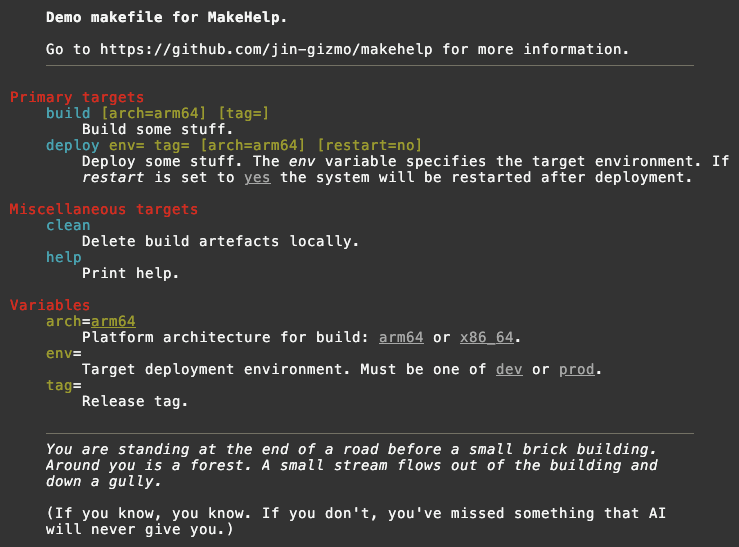
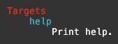
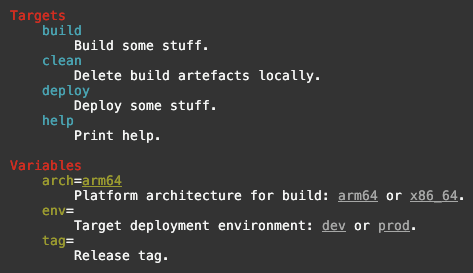
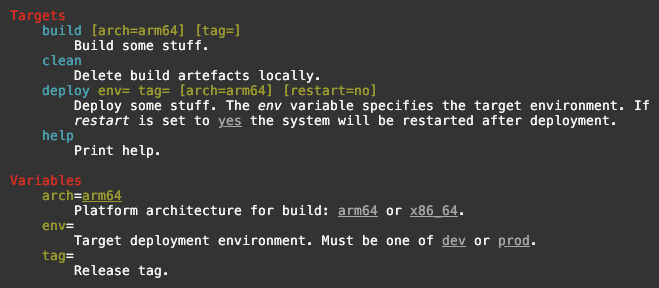

# Makefile Help Maker

<div align="center">

</div>

<br clear="left"/>

**MakeHelp** is a simple gizmo for auto-generating help documentation from
makefiles. It is trivial to get started with well presented makefile help, and
flexible enough to generate more complex makefile documentation when required.

**MakeHelp** consists of a single AWK script and a small makefile to
*include* in your own makefiles.

## Features

*   Embedded documentation for makefile targets and variables.

*   Supports *included* files within makefiles.

*   Grouping of documentation for targets and variables into named categories.

*   Generation of documentation for target specific makefile variables that can
    be set on the command line, including recursive resolution of dependency
    variables.

*   Automated text filling and wrapping.

*   Interpolation of makefile variable values into documentation text.

*   Simple markdown-style in-line formatting of text.

*   Themes giving control over colour selection for headings etc.

*   Supports Linux and macOS, GNU and POSIX AWK.

> If it ain't broke, it doesn't have enough features yet.

Here is a sample of help output for a fully kitted out makefile.



## Genesis

Almost every makefile should have a default target named `help` that does
nothing but print some help for the user.

The [Jin Gizmo](https://jin-gizmo.github.io) tools have multiple, moderately
complex makefiles, with lots of targets and options in the form of makefile
variables that can (or must) be set on the **make** command line.  Historically,
these have been maintained with carefully hand-crafted `help` targets. This has
some obvious problems:

*   The help text is divorced from the things being documented so there is a
    risk of inconsistency.

*   It's tedious and error prone to format the help text nicely and pretty much
    impossible to account for variations in terminal width. 
    
*   Anyone reading the makefile has to flip back and forth between the help
    text and the actual target / variable definitions to work out what's going
    on, or else there is duplication between embedded comments and help text.

There are some clever one-liners out there for generating makefile help
documentation from embedded comments, typically using some combination of
**sed** and/or AWK.  Really clever.

But ...

They are all pretty limited, producing simple basic text documentation with
little or no formatting using code that is impenetrable hieroglyphics.

I tried using these. I really did. It was frustrating and the results were less
than satisfying for even moderately complex makefiles.

So, I foolishly thought, how hard can this be? A little AWK script will nail
it. Then it sort of got away from me a bit. **MakeHelp** is the result. Best of
luck.

> In salute to the one-liners, they were the inspiration for **MakeHelp**, which
> uses the same basic technique of adding special comments into the makefile to
> produce help documentation.

## Getting Started

[Download](https://github.com/jin-gizmo/makehelp/releases/latest) the
**MakeHelp** source code ZIP or tar.gz bundle and unpack it, either in the same
directory as your makefile, or wherever you like. The two files from the bundle
need to stay together in the one directory.

Add the following line to your makefile, assuming the **MakeHelp** components
are in the same directory. (Update the location appropriately if a different
directory was used.)

```makefile
include help.mk
```

You will need to disable any existing `help` target in your makefile. (Just
change the name while playing around.)

Try it out:

```bash
make help
# ... or ...
make
```

You should see something like this as **MakeHelp** documents the `help` target
it generates.



> Note that `help.mk` will set the default target to be `help`.

## The Basics

From this point, we'll use the following simple makefile as an example:

```makefile
# Demo makefile for **MakeHelp**.

include help.mk

env=
arch:=$(shell arch)
restart=no
tag=

build:
	@echo Building for $(arch) ...

deploy: preflight build
	@echo Deploying to $(env) with restart=$(restart) ...

preflight:
	@echo Check everything is in order for deployment

clean:
	@echo Cleaning build artefacts ...	
```

This might be used like so:

```bash
make build arch=x86_64
make deploy env=prod restart=yes
```

The first step is to add some comments above the targets and variables we want
included in help text using `##` as the comment marker. **MakeHelp** will
recognise these. Comments with a single `#` are ignored.

```makefile
# Demo makefile for MakeHelp.

include help.mk

## Target deployment environment: `dev` or `prod`.
env=
## Platform architecture for build: `arm64` or `x86_64`.
arch:=$(shell arch)
## Release tag.
tag=
restart=no

## Build some stuff.
build:
	@echo Building for $(arch) ...

## Deploy some stuff.
deploy:	preflight build
	@echo Deploying to $(env) with restart=$(restart) ...

preflight:
	@echo Check everything is in order for deployment

## Delete build artefacts locally.
clean:
	@echo Cleaning build artefacts ...
```

The result from `make` is now:



Key points:

*   `##` comments just before a target or variable are collected to provide a
    description for it. These will be filled and wrapped automatically. A line
    containing only `##` starts a new paragraph.

*   `#` comments are ignored.

*   Descriptions can contain simple Markdown-like in-line styling:
    \*\***bold**\*\*, \**italic*\*, \__underline_\_ and \``code`\`. 

*   Descriptions can also contain `$(var)` substitutions of variables from the
    makefile itself. For variables with computed values (e.g. `x=$(shell ...)`),
    you may need to use the `:=` form of **make** variable assignment to force
    early evaluation. A **make** variable can be defined before or after it is
    referenced in the makefile.

*   For the variables section of the help, **MakeHelp** will show the default
    value, if possible.

## Going Further

So far, so good. 

We're still missing any clear indication of the variables that may be applicable
to specific **make** targets. Yes, we can add this information into the target
descriptions, but we can do a bit better than that.

**MakeHelp** [directives](#directives) provide additional information and
control for the help text. Directive lines start with `#@` *immediately*
followed by the directive name. We can use the `#@req` and `#@opt` directives to
specify the required and optional **make** command line variables, respectively.

```makefile
# Demo makefile for MakeHelp.

include help.mk

## Target deployment environment. Must be one of `dev` or `prod`.
env=
## Platform architecture for build: `arm64` or `x86_64`.
arch:=$(shell arch)
## Release tag.
tag=
restart=no

## Build some stuff.
#@opt arch tag
build:
	@echo Building for $(arch) ...

## Deploy some stuff. The *env* variable specifies the target environment.
## If *restart* is set to `yes` the system will be restarted after deployment.
#@req env tag
#@opt restart
deploy:	preflight build
	@echo Deploying to $(env) with restart=$(restart) ...

preflight:
	@echo Check everything is in order for deployment

## Delete build artefacts locally.
clean:
	@echo Cleaning build artefacts ...
```

The result from `make` is now:



A *deploy* operation would be invoked like so:

```bash
make deploy env=prod
# ... or ...
make deploy env=prod restart=yes
```

Key points:

*   `#@req` and `#@opt` directives precede the target to specify required
    and optional variables. They accept one or more string arguments of the form
    `name` / `name=value`. If a value is not specified in the directive,
    **MakeHelp** will show an existing defined value, if possible.

*   Multiple `#@req` / `#@opt` directives are allowed. The contents are
    aggregated.

*   By default, `#@req` and `#@opt` directives are resolved recursively down the
    tree of dependencies. The `deploy` target depends on the `build` target
    which accepts an optional `arch` and `tag` variables, so `deploy` is also
    shown as accepting them.

*   The `tag` variable is *optional* for the `build` target but is upgraded to
    *required* for the `deploy` target. Required variables override optional
    ones.


## Getting Fancy

For a simple makefile, like our sample, what we have above is plenty. For large,
complex makefiles, it can be handy to group targets and variables into related
categories and present them in a defined order. This is achieved with `#@cat`
directives for targets and `@vcat` directives for variables.

It can also be helpful to include some broader explanatory information as a
prologue / epilogue to the help text as a whole. Lines starting with `#+` become
the prologue and those starting with `#-` become the epilogue.

```makefile
include help.mk

# Draw horizontal rules to separate prologue / epilogue from the main help body.
HELP_HR=yes
# Assign the "help" target to this category.
HELP_CATEGORY=Miscellaneous targets

#+ **Demo makefile for MakeHelp**.
#+
#+ Go to https://github.com/jin-gizmo/makehelp for more information.

#- *You are standing at the end of a road before a small brick building. Around*
#- *you is a forest. A small stream flows out of the building and down a gully.*
#-
#- (If you know, you know. If you don't, you've missed something that AI will
#- never give you.)

# ------------------------------------------------------------------------------
## Target deployment environment. Must be one of `dev` or `prod`.
env=
## Release tag.
tag=
## Platform architecture for build: `arm64` or `x86_64`.
arch:=$(shell arch)
restart=no

#@cat Primary targets

## Build some stuff.
#@opt arch tag
build:
	@echo Building for $(arch) ...

## Deploy some stuff. The *env* variable specifies the target environment.
## If *restart* is set to `yes` the system will be restarted after deployment.
#@req env tag
#@opt restart
deploy:	preflight build
	@echo Deploying to $(env) with restart=$(restart) ...

preflight:
	@echo Check everything is in order for deployment

#@cat Miscellaneous targets

## Delete build artefacts locally.
clean:
	@echo Cleaning build artefacts ...
```


Key points:

*   `#@cat` directives specify the category to which all subsequent targets are
    assigned until another `#@cat` directive sets a new value. The starting
    value is `Targets`.

*   The `help` target is special because it is provided as part of the included
    `help.mk`. To assign it to a non-default category, set `HELP_CATEGORY` in
    the makefile.

*   Target categories are sorted in the order in which they are first referenced.
    If targets aren't naturally sorted in the makefile, add a set of `#@cat`
    directives at the top of the file to enforce the desired order.

*   To force categories to be sorted alphabetically, set `HELP_SORT=alpha` in
    the makefile.

*   Variable categories are always shown after target categories.

*   Within categories, targets and variables are sorted alphabetically.

*   `#@vcat` works exactly the same way as `#@cat` except for variables instead
    of targets. The initial variable category is `Variables`.

*   Formatting of the prologue and epilogue works the same way as for target and
    variable descriptions, including in-line styling, variable substitutions,
    filling and wrapping.

## Directives

**MakeHelp** *directives* provide additional information and control for the
help text. Directive are lines in the source makefile starting with `#@`
*immediately* followed by the directive name.

> There is no space between the `#@` and the directive name. `#@ cat` means
> nothing to **MakeHelp**. 

| Directive | Description                                                  |
| --------- | ------------------------------------------------------------ |
| `#@cat`   | Set the current category for targets. All subsequent targets will be assigned to this category until a new value is set. The starting value is `Targets`. |
| `#@opt`   | Declare one or more variables as optionally accepted by the next target. The directive accepts one or more string arguments of the form `name` or `name=value`. If a value is not specified in the directive, **MakeHelp** will show an existing defined value, if possible |
| `#@req`   | Declare one or more variables as required by the next target. Details as for `#@opt`. |
| `#@var`   | Declare the value of a **make** variable for use by **MakeHelp**. The directive accepts a string argument in the form `name=value`.  This is used by the provided `help.mk` makefile to pass **make** variables to **MakeHelp**. It should rarely be needed in a user makefile. |
| `#@vcat`  | Set the current category for variables. All subsequent variables will be assigned to this category until a new value is set. The starting value is `Variables`. |

## Make Variables used by MakeHelp

**MakeHelp** recognises a few special variables that can be set in the source
makefile to control elements of its behaviour.

| Make Variable       | Description                                                  |
| ------------------- | ------------------------------------------------------------ |
| `HELP_CATEGORY`     | Specifies the category to which the `help` target is assigned. Set it to `none` to exclude the `help` target from the help documentation. Defaults to `Targets`. |
| `HELP_DEPENDENCIES` | If set to `no`, don't include the variable requirements of dependencies of targets. By default, variable requirements of any dependencies of a target are (recursively) added to those of the target itself as declared in `#@req` and `#@opt` directives. |
| `HELP_HR`           | If set to `yes`, add horizontal rules after the prologue and before the epilogue. This may not work in some terminals (e.g. macOS Terminal.app) but it's harmless. Defaults to `no`. |
| `HELP_SORT`         | By default, categories are sorted in the order in which they are first referenced. Set `HELP_SORT` to `alpha` so sort categories alphabetically. |
| `HELP_THEME`        | Colour theme for generated help. Options are `basic` (the default), `light`, `dark` and `none`. The latter removes all ANSI escape sequences used to colour text. |
| `HELP_WIDTH`        | Specifies the terminal width (columns) for filling and wrapping of descriptions. Defaults to the actual terminal width. The minimum allowed value is 65. |


# More Gizmos

For more gizmos, check out Jin Gizmo.

[](https://jin-gizmo.github.io)

# Release Notes

#### v1.0.0

Initial release.

